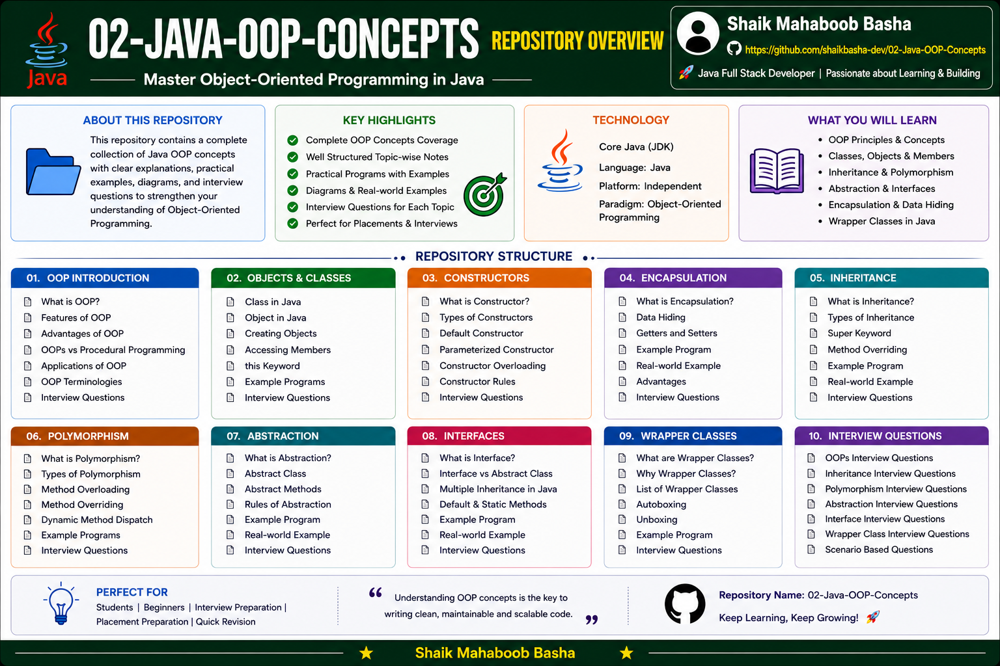

# Java OOP Concepts

## Overview

This repository contains comprehensive learning materials on **Object-Oriented Programming (OOP) in Java**.

The content is organized from basic to advanced topics and includes:

* Theory and explanations
* Java programs with detailed explanations
* Flowcharts and diagrams
* Interview Questions and Answers
* Real-world examples
* Revision notes

The primary goal of this repository is to provide a structured learning path for Java OOP concepts and interview preparation.

## Repository Overview

## Repository Structure

### 01 - OOP Introduction

This section introduces the fundamentals and core principles of Object-Oriented Programming.

Topics Covered:

* OOP Introduction
* OOP Interview Questions and Answers

### 02 - Creating Object and Accessing Members

This section explains classes, objects, object creation, and accessing class members in Java.

Topics Covered:

* Class and Object
* Creating Single Object
* Multiple Objects Example
* Class and Object Diagrams
* Flowcharts
* Box Diagrams
* Interview Questions

### 03 - Constructors

This section covers constructors, their types, and constructor-related concepts in Java.

Topics Covered:

* Constructors Introduction
* Default Constructor
* No Argument Constructor
* Parameterized Constructor
* Constructor Overloading
* Copy Constructor
* Constructor Chaining
* this Keyword
* this() Method
* Constructor vs Method
* Constructor Flow Diagram
* Interview Questions

### 04 - Encapsulation

This section explains encapsulation and data hiding in Java.

Topics Covered:

* Encapsulation Introduction
* Data Hiding
* Getters and Setters
* Encapsulation Using Private Variables
* Encapsulation vs Data Hiding
* Advantages of Encapsulation
* Diagrams
* Flowcharts
* Interview Questions

### 05 - Inheritance

This section covers inheritance, its types, and related Java concepts.

Topics Covered:

* Inheritance Introduction
* Single Inheritance
* Multilevel Inheritance
* Hierarchical Inheritance
* Multiple Inheritance Using Interface
* Hybrid Inheritance
* IS-A Relationship
* super Keyword
* Method Overriding
* Dynamic Method Dispatch
* Diagrams
* Flowcharts
* Interview Questions

### 06 - Polymorphism

This section explains compile-time and runtime polymorphism in Java.

Topics Covered:

* Introduction to Polymorphism
* Compile Time Polymorphism
* Method Overloading
* Rules of Method Overloading
* Runtime Polymorphism
* Method Overriding
* Rules of Method Overriding
* Dynamic Method Dispatch
* Covariant Return Type
* Diagrams
* Flowcharts
* Interview Questions

### 07 - Abstraction

This section explains abstraction, abstract classes, and abstract methods in Java.

Topics Covered:

* Introduction to Abstraction
* Abstract Class Rules
* Abstract Methods Deep Dive
* Abstraction vs Encapsulation
* Important Concepts
* Interview Questions and Answers
* Final Revision Notes
* Programs with Detailed Explanation
* Realistic Abstraction Examples

### 08 - Interface

This section covers Java interfaces and their important features.

Topics Covered:

* Introduction to Interface
* Interface Rules
* Abstract Methods in Interface
* Default Methods in Interface
* Static Methods in Interface
* Interface vs Abstract Class
* Interview Questions

### 09 - Wrapper Classes

This section explains Java Wrapper Classes and conversions between primitive values and wrapper objects.

Topics Covered:

* Introduction to Wrapper Classes
* Auto-boxing
* Un-boxing
* parseInt()
* valueOf()
* Interview Questions and Answers

## Features of This Repository

This repository provides:

* Beginner to advanced OOP concepts
* Well-structured learning path
* Detailed theory notes
* Java programs with explanations
* Interview questions and answers
* Revision notes
* Flowcharts and diagrams
* Real-world examples
* Topic-wise organization
* Suitable for placement and interview preparation

## Technologies Used

* Java
* Object-Oriented Programming (OOP)
* Git
* GitHub
* Markdown

## Interview Preparation

Interview questions and answers are included for:

* OOP Fundamentals
* Classes and Objects
* Constructors
* Encapsulation
* Inheritance
* Polymorphism
* Abstraction
* Interfaces
* Wrapper Classes

The interview preparation content is structured to strengthen conceptual understanding and support Java technical interview preparation.

## Purpose

This repository is created to:

* Strengthen Java OOP concepts
* Practice Java programming fundamentals
* Prepare for Java technical interviews
* Understand real-world applications of OOP principles
* Build a structured knowledge base for continuous learning
* Support quick revision and placement preparation

## Who Can Use This Repository

This repository is useful for:

* Beginners learning Object-Oriented Programming
* Java students
* College students
* Freshers preparing for technical interviews
* Placement preparation
* Java interview preparation
* Developers revising OOP concepts

## Author

**Shaik Mahaboob Basha**

B.Tech - Electronics and Communication Engineering

Aspiring Java Full Stack Developer

## Support

If this repository helps you in your learning journey, interview preparation, or future reference, please consider giving it a **Star ⭐**. Your support is greatly appreciated and motivates me to continue creating high-quality educational repositories.

## Conclusion

This repository is created as a comprehensive Java Object-Oriented Programming learning and interview preparation resource. It contains OOP concepts, practical programs, detailed explanations, diagrams, flowcharts, real-world examples, and interview questions arranged in a structured manner for easy learning, revision, and technical interview preparation.

Happy Learning and Keep Coding!
